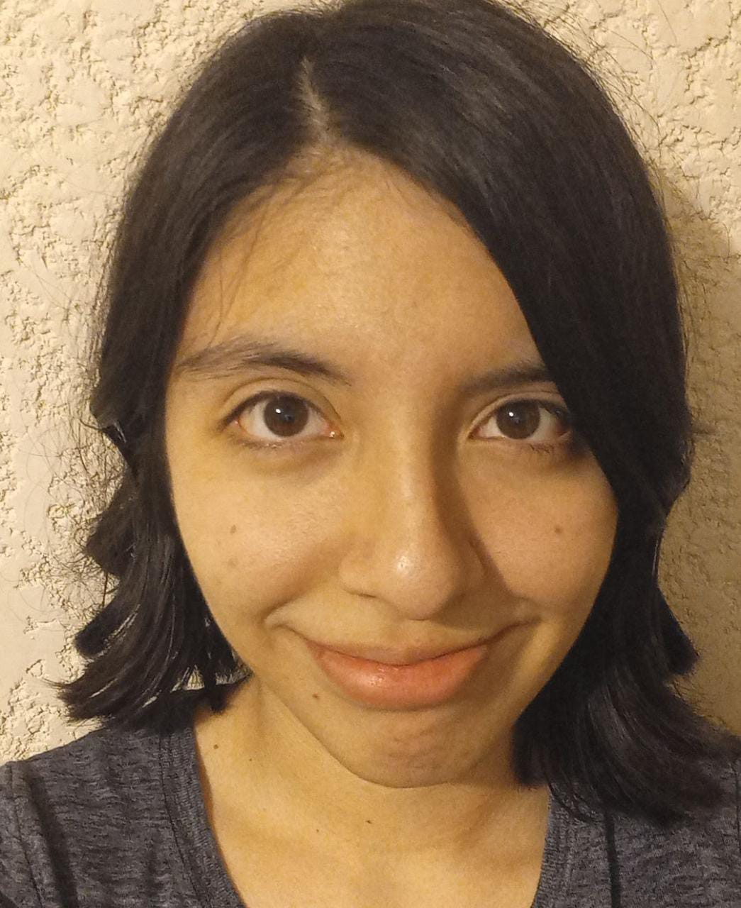

```{r setup, include=FALSE}
knitr::opts_chunk$set(echo = TRUE)
```



## Datos personales
- Fecha de nacimiento: 25/02/2002
- Carrera: Licenciatura en ciencias genómicas (en curso)

## Mis cursos
- Curso de programación en la licenciatura en ciencias genómicas (2020).
- Curso de cómputo científico en la licenciatura en ciencias genómicas (2021).
- Curso de R en la licenciatura en ciencias genómicas (2021).
- Curso de bioinformática en la licenciatura en ciencias genómicas (2020-2022).
- Python I (https://github.com/Danigore25/python_class). Curso de python en la licenciatura en ciencias genómicas.
- Python II (https://github.com/Danigore25/python2). Curso de Biopython en la licenciatura en ciencias genómicas.

## Contacto y redes sociales
- Correo: dgoretti@lcg.unam.mx, danigore22@gmail.com
- Facebook: Gore Castillo
- Twitter: @Danigore25
